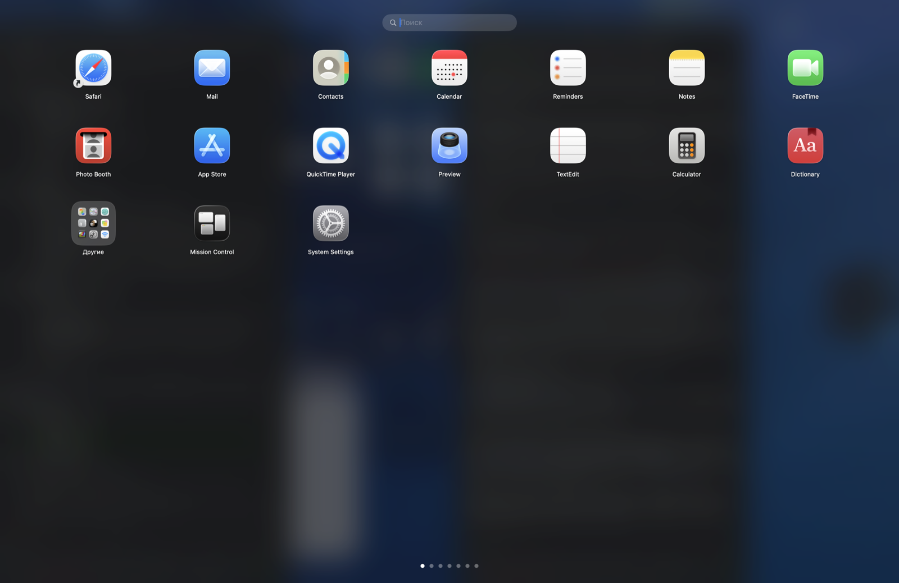

# Launchpad

Открытый бесплатный аналог классического **Launchpad** для macOS, который Apple
убрала в macOS 26 (Tahoe). Возвращает привычную полноэкранную сетку приложений
со страницами и папками. Аналог [LaunchNext](https://github.com/RoversX/LaunchNext)
и AppGrid, но полностью бесплатный и с открытым кодом (MIT).



## Возможности

- 🚀 **Полноэкранная сетка** приложений со страницами и точками-индикаторами
- 📁 **Папки** — перетащите одно приложение на другое, чтобы создать папку;
  название можно менять
- ↔️ **Перенос между страницами** — тащите иконку к краю экрана, страницы
  листаются; у правого края создаётся новая страница
- ⚙️ **Настройки** (`⌘,`) — размер сетки (колонки/строки) и выбор горячей клавиши
- 📥 **Импорт старой раскладки** — читает базу данных системного Launchpad
  (`~/Library/Application Support/Dock/*.db`) и восстанавливает ваши страницы,
  порядок и папки по bundleID
- 🔍 **Поиск** по названию (нажмите Enter — запустится первый результат)
- 🤏 **Жест щипка** — сведение нескольких пальцев открывает Launchpad
  (чтение трекпада через MultitouchSupport), щипок внутри — закрывает
- ⌨️ **Горячая клавиша** `F4` (или `⌥⌘Space`) открывает/закрывает
- 🖱️ **Листание** страниц: свайп двумя пальцами, стрелки ←/→, точки внизу
- 🎨 Живое **размытие** рабочего стола на фоне
- 🪶 Живёт в строке меню, **без иконки в Dock** (агент-приложение)

## Требования

- macOS 13 (Ventura) и новее
- Swift 5.9+ (входит в Xcode или Command Line Tools — полный Xcode **не нужен**)

## Установка

**Готовый DMG** (проще всего): скачайте `Launchpad-x.y.z.dmg` из
[Releases](https://github.com/ev609/Launchpad/releases), откройте и перетащите
Launchpad в Applications. Ad-hoc подпись — при первом запуске снимите карантин:
`xattr -dr com.apple.quarantine /Applications/Launchpad.app`.

**Из исходников:**

```bash
git clone <repo> Launchpad && cd Launchpad
./scripts/build_app.sh release   # или ./scripts/install.sh — сразу в /Applications
open build/Launchpad.app
```

Дальше приложение **обновляется само** через GitHub Releases (меню
«Проверить обновления…» и тихая проверка при запуске).

### Скрипты сборки

- `scripts/build_app.sh` — собрать `.app`
- `scripts/install.sh` — собрать и установить в `/Applications`
- `scripts/make_dmg.sh` — собрать DMG для ручной раздачи
- `scripts/release.sh 0.2.0` — выпустить релиз (zip + dmg) в GitHub Releases

Приложение появится в строке меню (иконка сетки 3×3). Нажмите на неё или `F4`,
чтобы открыть Launchpad.

> Если `F4` не срабатывает — включите в
> «Системные настройки → Клавиатура» опцию использовать F1–F12 как стандартные
> функциональные клавиши, либо пользуйтесь `⌥⌘Space` или иконкой в строке меню.

### Открытие щипком (важно для macOS Tahoe)

Чтобы щипок пальцами открывал **этот** Launchpad, а не системный Spotlight:

1. **Системные настройки → Трекпад → Ещё жесты** — отключите системный жест
   щипка (бывший «Launchpad», на Tahoe открывает Spotlight). Иначе откроются оба.
2. При первом использовании macOS может запросить разрешение
   **«Мониторинг ввода»** (Input Monitoring) — разрешите приложению в
   «Настройки → Конфиденциальность и безопасность → Мониторинг ввода».

После этого сведение нескольких пальцев на трекпаде открывает Launchpad.

### Автозапуск при входе

Включите в меню строки состояния **«Запускать при входе»** (или в Настройках).
Реализовано через `SMAppService` — отдельно добавлять в объекты входа не нужно.

## Меню в строке меню

- **Открыть Launchpad**
- **Импортировать раскладку старого Launchpad** — восстановить страницы и папки
- **Сбросить раскладку (по алфавиту)**
- **Обновить список приложений** — пересканировать после установки новых программ
- **Запускать при входе** — автозапуск (галочка)
- **Настройки…**
- **Выход**

## Как это работает

- **Сканирование** приложений: `/Applications`, `/System/Applications`,
  `~/Applications` и их подпапки (`AppScanner`).
- **Импорт**: база Launchpad — это SQLite. Таблица `items` хранит дерево
  (корень → страницы → приложения/папки), `apps` — bundleID, `groups` —
  названия папок. `LaunchpadImporter` обходит дерево и сопоставляет приложения
  с установленными по bundleID; отсутствующие пропускаются.
- **Раскладка** сохраняется в
  `~/Library/Application Support/Launchpad/layout.json` и при каждом запуске
  сверяется с реально установленными приложениями (удалённые убираются, новые
  добавляются в конец).

## Структура проекта

```
Sources/Launchpad/
  App/            точка входа, AppDelegate (окно-оверлей, меню, хоткеи)
  Models/         AppEntry, Folder, Page, Layout, LaunchpadModel
  Services/       AppScanner, IconCache, AppLauncher, LayoutStore, LaunchpadImporter
  Views/          сетка, ячейки, папки, поиск, корневой экран
  Utils/          горячие клавиши, уведомления, диагностика
scripts/build_app.sh   сборка .app-бандла
```

## Диагностика

Проверить сканирование и импорт без запуска GUI:

```bash
swift build && .build/debug/Launchpad --dump-import
```

## Планы (roadmap)

- [x] Перетаскивание между страницами
- [x] Иконка приложения (`AppIcon.icns`)
- [x] Настройки: размер сетки, число колонок/строк, выбор горячей клавиши
- [ ] Удаление приложений из папок жестом
- [ ] Автоопределение категорий для имён папок
- [ ] Локализация (сейчас интерфейс на русском)

## Лицензия

MIT — см. [LICENSE](LICENSE).
